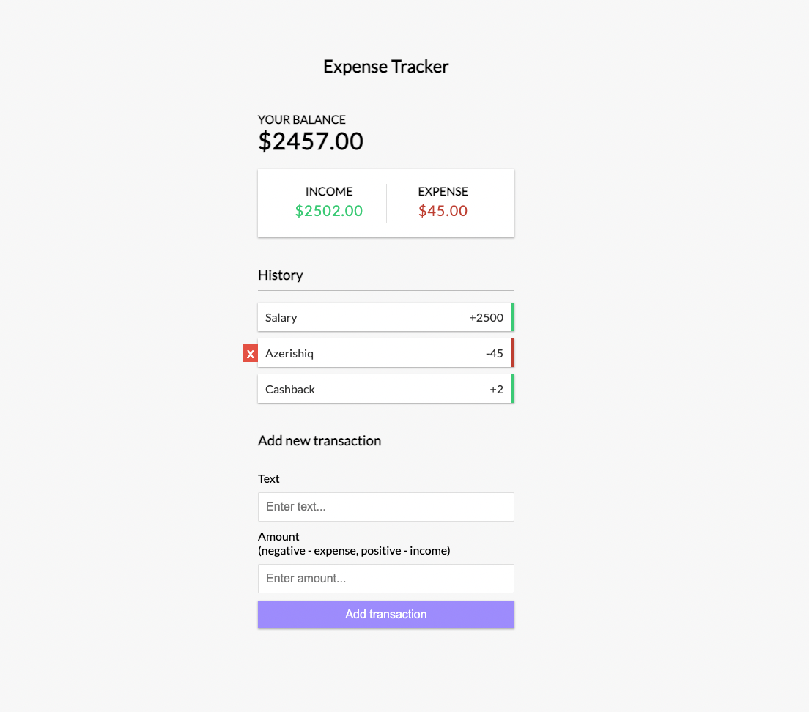

# Expense Tracker 💰

## Demo 🎯
[EXPENSE TRACKER APP](https://defaultsabina.github.io/expense-tracker-app)

Create an amazing Expense tracker app using React.js 🚀

#### Mandatory tasks:
1. The app has 3 component: 
  - ***Balance*** - which will display *total balance*, *incomes* and *expenses*.
  - ***History*** - which will display List of your *incomes* and *expenses*.
  - ***Transaction*** - form where you can add a new transaction.
2. If the transaction amount is less than zero, then the expense increase. If the transaction amount is greater than zero, then the income increases. Note: updating **Total balance** as well!
3. When you hover over any transaction, a **delete** button should appear. By clicking this button, you can delete any transaction.

---

